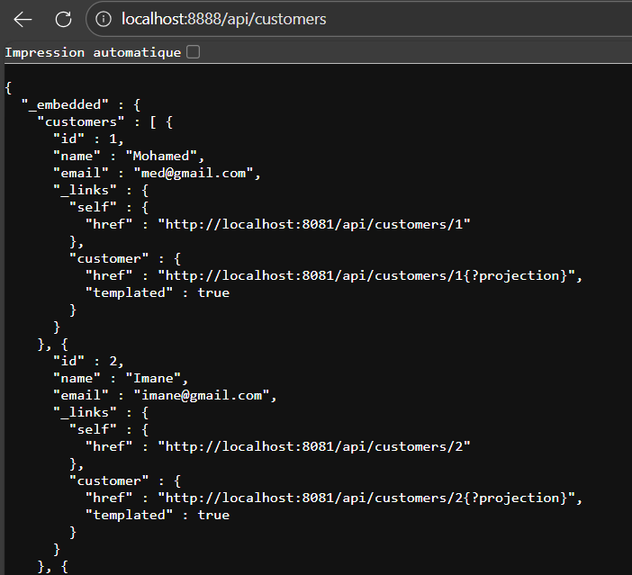
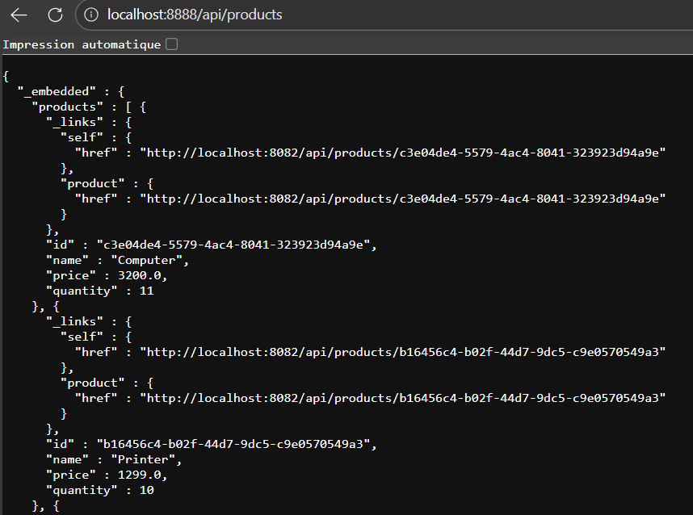
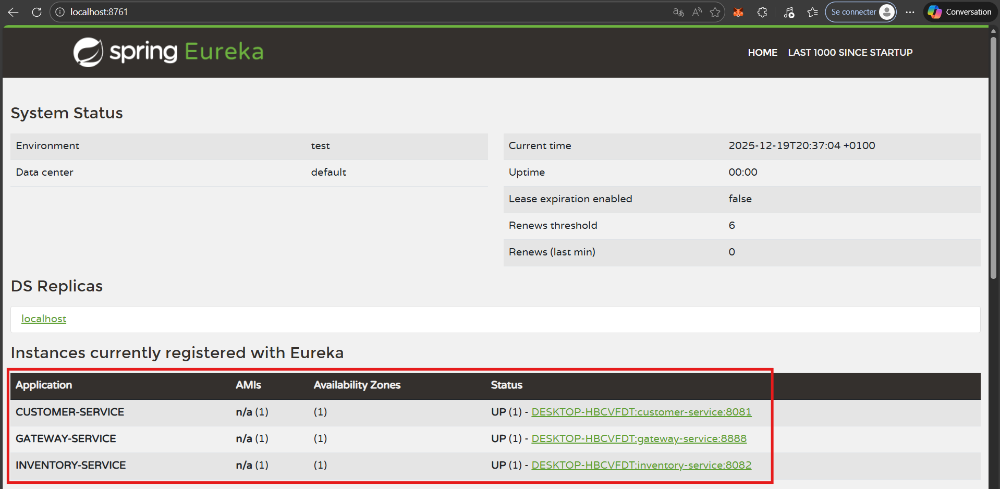
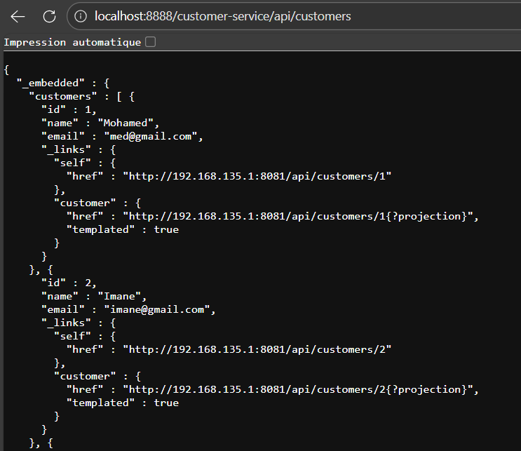
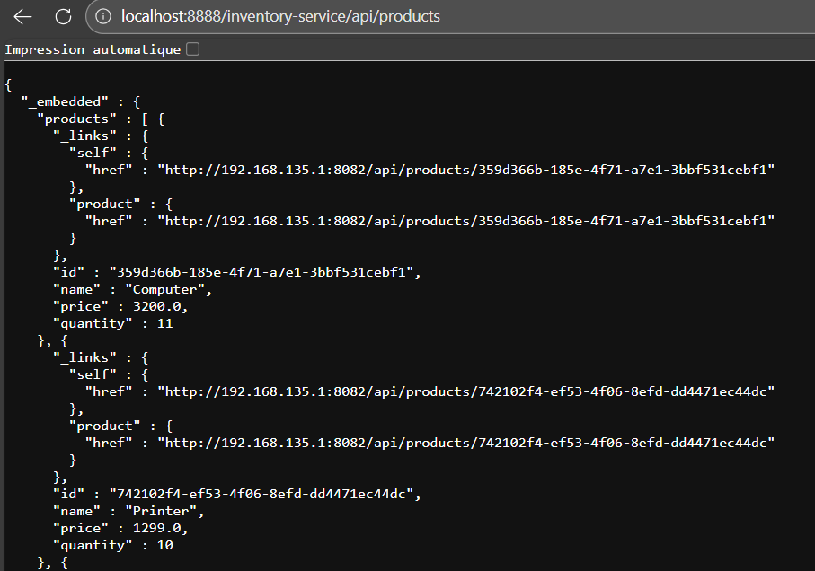
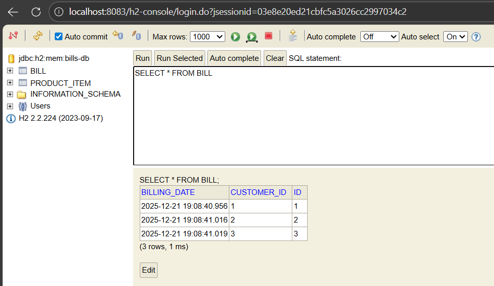
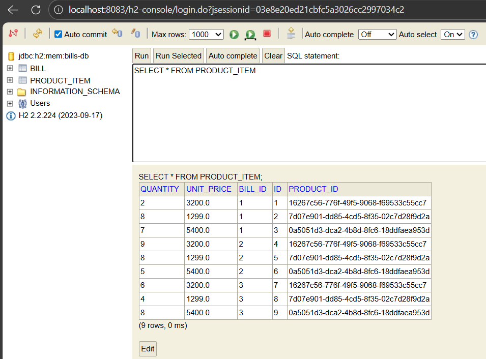
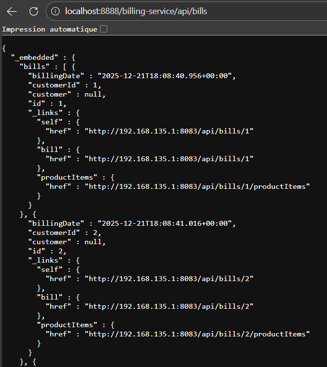
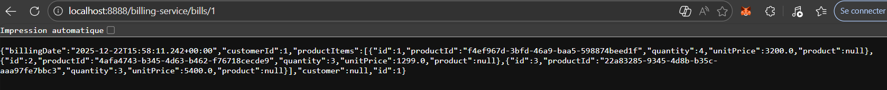
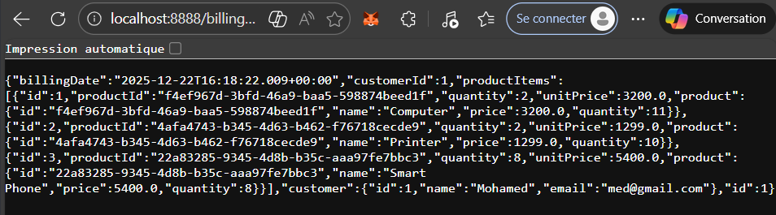

# Activité Pratique N°3 - Développement d'une architecture micro-services

## Introduction

Cette activité pratique a pour objectif de mettre en œuvre une **architecture micro-services complète** basée sur l’écosystème **Spring Boot et Spring Cloud**. L’architecture micro-services constitue aujourd’hui une approche de référence pour le développement d’applications distribuées, scalables et résilientes, en particulier dans des contextes nécessitant une forte modularité et une évolution indépendante des composants.

L’application développée dans ce TP permet la **gestion des factures**, lesquelles sont associées à des **clients** et contiennent des **produits**. Chaque responsabilité fonctionnelle est isolée dans un micro-service indépendant, communiquant avec les autres services via des **API REST**. Cette approche favorise la séparation des préoccupations, la maintenabilité du système et la possibilité de déploiement indépendant de chaque service.

Au cours de cette activité pratique, plusieurs concepts clés des systèmes distribués sont abordés, notamment :

* la **décomposition d’une application monolithique en micro-services**,
* la **découverte dynamique des services** à l’aide de **Eureka Discovery Service**,
* le **routage des requêtes** via **Spring Cloud Gateway** avec une configuration statique et dynamique,
* la **communication inter-services** à l’aide de **OpenFeign**,
* la **centralisation de la configuration** avec **Spring Cloud Config Server**,
* ainsi que la mise en place d’un **client frontend Angular** pour l’interaction avec le système.

Cette activité permet ainsi de consolider les compétences pratiques liées aux **architectures micro-services**, à la **communication distribuée**, et à l’utilisation des **outils modernes du cloud natif**, tout en respectant les bonnes pratiques de conception des systèmes distribués.

---

## Mise en place de l'environnement de développement

Avant de commencer le développement des différents micro-services, une **organisation globale du projet** a été mise en place afin de faciliter la gestion, la cohérence et l’évolutivité de l’application. Pour cela, un **projet Maven parent** a été créé. Ce projet parent joue le rôle de conteneur principal et regroupe l’ensemble des micro-services développés dans le cadre de cette activité pratique.

Chaque micro-service (customer-service, inventory-service, billing-service, gateway, discovery-service, config-service, etc.) est implémenté sous la forme d’un **module Maven indépendant**, basé sur **Spring Boot**. Cette approche permet :

* une **séparation claire des responsabilités** entre les différents services,
* une **gestion centralisée des dépendances** via le `pom.xml` parent,
* une **uniformisation des versions** des bibliothèques Spring,
* ainsi qu’un **développement, un test et un déploiement indépendants** de chaque micro-service.

L’utilisation de Maven comme outil de gestion de projet et de dépendances, combinée à Spring Boot, simplifie la configuration initiale et accélère le développement des micro-services. Cette structure modulaire constitue une base solide pour la mise en œuvre d’une **architecture micro-services conforme aux bonnes pratiques des systèmes distribués**.

## I. Créer le micro-service customer-service qui permet de gérer les client

Le micro-service **Customer-Service** a pour rôle principal la **gestion des clients** de l’application. Il constitue l’un des services fondamentaux du système, puisqu’il fournit les informations relatives aux clients (nom, email, identifiant) utilisées par les autres micro-services, notamment le service de facturation.

### 1. Création du module Spring Boot

Le micro-service *Customer-Service* a été créé sous forme d’un **module Maven Spring Boot** intégré au projet parent. Ce module est totalement indépendant et peut être démarré, testé et déployé séparément des autres services, ce qui respecte les principes de l’architecture micro-services.

L’application repose sur **Spring Boot 3**, **Spring Data JPA** et **Spring Data REST**, ce qui permet d’exposer automatiquement des API REST à partir des repositories JPA, sans implémenter explicitement des contrôleurs REST.

Le micro-service s’appuie sur plusieurs dépendances essentielles :

* **Spring Boot Starter Web** pour la création d’API REST,
* **Spring Data JPA** pour la persistance des données,
* **Spring Data REST** pour l’exposition automatique des repositories,
* **H2 Database** pour la base de données en mémoire,
* **Spring Cloud Eureka Client** pour l’intégration future avec le service de découverte,
* **Spring Cloud Config Client** pour la centralisation de la configuration,
* **Lombok** pour simplifier le code,
* **Spring Boot Actuator** pour la supervision et le monitoring.


### 2. Structure du projet

Le micro-service est organisé selon une architecture en couches claire, facilitant la lisibilité et la maintenabilité du code :

```
main
├── java
│   └── org.example.customerservice
│       ├── config
│       │   └── RestRepositoryConfig
│       ├── entities
│       │   ├── Customer
│       │   ├── CustomerProjection
│       │   └── CustomerProjectionEmail
│       ├── repository
│       │   └── CustomerRepository
│       └── CustomerServiceApplication
└── resources
```

Cette organisation sépare clairement :

* la **configuration**,
* les **entités métier**,
* la **couche d’accès aux données**,
* et la **classe principale de démarrage**.

### 3. Modélisation de l’entité Customer

L’entité **Customer** représente un client du système. Elle est persistée dans une base de données **H2 en mémoire** à l’aide de JPA.

Elle est composée des attributs suivants :

* `id` : identifiant unique du client (clé primaire),
* `name` : nom du client,
* `email` : adresse email du client.

Les annotations JPA permettent la gestion de la persistance, tandis que **Lombok** est utilisé pour réduire le code boilerplate (getters, setters, constructeurs).

### 4. Gestion des projections Spring Data REST

Afin d’optimiser les réponses REST et de contrôler les données exposées, des **projections Spring Data REST** ont été mises en place :

* **CustomerProjection** : permet d’exposer le nom et l’email du client.
* **CustomerProjectionEmail** : permet d’exposer uniquement l’email du client.

Ces projections offrent une meilleure flexibilité dans l’exposition des données et évitent le surchargement inutile des réponses REST.

### 5. Couche Repository

L’interface **CustomerRepository** étend `JpaRepository`, ce qui permet de bénéficier automatiquement des opérations CRUD standards (Create, Read, Update, Delete).

Grâce à l’annotation `@RepositoryRestResource`, Spring Data REST expose automatiquement ce repository sous forme d’API REST, sans nécessiter l’implémentation manuelle de contrôleurs.

Les endpoints REST sont accessibles via le chemin de base :

```
/api/customers
```


### 6. Configuration REST et exposition des identifiants

Par défaut, Spring Data REST n’expose pas les identifiants des entités. Afin de rendre l’attribut `id` accessible dans les réponses JSON, une classe de configuration **RestRepositoryConfig** a été ajoutée.

Cette configuration permet explicitement l’exposition de l’identifiant de l’entité **Customer**, ce qui est indispensable pour les communications inter-services.

### 7. Configuration de l’application

Le micro-service est configuré à l’aide du fichier `application.properties`. Les principaux paramètres définis sont :

* le **nom du service** (`customer-service`),
* le **port d’écoute** (`8081`),
* l’utilisation d’une **base de données H2 en mémoire**,
* l’activation de la **console H2**,
* la désactivation temporaire de **Eureka** et du **Config Server** pour les phases initiales de développement,
* la définition du **chemin de base des API REST** (`/api`).

## II. Créer le micro-service inventory-service qui permet de gérer les produits

Le micro-service **Inventory-Service** est chargé de la **gestion des produits** disponibles dans le système. Il permet de stocker, consulter et gérer les informations relatives aux produits, telles que leur identifiant, leur nom, leur prix et leur quantité en stock. Ce service joue un rôle essentiel dans le processus de facturation, car il fournit les données nécessaires à la composition des factures.

### 1. Création du module Spring Boot

À l’instar du micro-service *Customer-Service*, le micro-service *Inventory-Service* a été implémenté sous forme d’un **module Maven Spring Boot indépendant**, intégré au projet parent.
Il utilise les **mêmes dépendances principales** (Spring Web, Spring Data JPA, Spring Data REST, H2, Eureka Client, Config Client, etc.) afin d’assurer une cohérence technologique entre les différents micro-services du système.

### 2. Structure du projet

Le micro-service *Inventory-Service* adopte une structure similaire à celle du *Customer-Service*, favorisant l’uniformité et la maintenabilité de l’architecture globale :

```
main
├── java
│   └── org.example.inventoryservice
│       ├── config
│       │   └── RestRepositoryConfig
│       ├── entities
│       │   └── Product
│       ├── repository
│       │   └── ProductRepository
│       └── InventoryServiceApplication
└── resources
```

Cette organisation permet une séparation claire entre :

* la configuration de l’exposition REST,
* les entités métier,
* la couche repository,
* et la classe principale de démarrage de l’application.

### 3. Modélisation de l’entité Product

L’entité **Product** représente un produit du système de facturation. Elle est persistée à l’aide de **JPA** dans une base de données **H2 en mémoire**.

Elle est composée des attributs suivants :

* `id` : identifiant unique du produit (clé primaire de type `String`),
* `name` : nom du produit,
* `price` : prix unitaire du produit,
* `quantity` : quantité disponible en stock.

L’utilisation de **Lombok** permet de simplifier le code en générant automatiquement les constructeurs, getters, setters et la méthode `toString()`.

### 4. Couche Repository et exposition REST

L’interface **ProductRepository** étend `JpaRepository<Product, String>`, offrant automatiquement l’ensemble des opérations CRUD.

Grâce à l’annotation `@RepositoryRestResource`, Spring Data REST expose automatiquement ce repository sous forme d’API REST, sans implémentation explicite de contrôleurs.
Les ressources produits sont accessibles via le chemin de base :

```
/api/products
```


### 5. Configuration REST et exposition des identifiants

Comme pour le micro-service *Customer-Service*, une classe de configuration **RestRepositoryConfig** a été définie afin d’exposer l’identifiant de l’entité **Product** dans les réponses REST.

Cette configuration est indispensable pour permettre aux autres micro-services (notamment le service de facturation) de référencer correctement les produits.

### 6. Configuration de l’application

Le fichier `application.properties` du micro-service *Inventory-Service* définit les paramètres suivants :

* le **nom du service** (`inventory-service`),
* le **port d’écoute** (`8082`),
* l’utilisation d’une **base de données H2 en mémoire** (`products-db`),
* l’activation de la **console H2** pour le test et le débogage,
* la désactivation temporaire de **Eureka Discovery** et du **Config Server**,
* le chemin de base des API REST (`/api`).

### 7. Rôle du micro-service Inventory-Service dans l’architecture

Le micro-service *Inventory-Service* constitue la **source de vérité des produits** au sein de l’architecture micro-services. Il est consommé par d’autres services, notamment le **Billing-Service**, pour récupérer les informations nécessaires à la génération des factures, garantissant ainsi une séparation claire des responsabilités et une communication inter-services propre.

## III. Créer la Gateway Spring cloud Gateway

Dans une architecture micro-services, la **Gateway** joue un rôle central en tant que **point d’entrée unique** pour les clients. Elle permet de router les requêtes vers les micro-services appropriés, tout en masquant la complexité interne du système.
Dans cette activité pratique, une **Gateway basée sur Spring Cloud Gateway** a été mise en place afin de gérer le routage des requêtes vers les micro-services *Customer-Service* et *Inventory-Service*.

### 1. Création du module Gateway-Service

Le micro-service **Gateway-Service** a été créé sous forme d’un **module Maven Spring Boot indépendant**. Contrairement aux autres micro-services, la gateway ne contient pas de logique métier ni de couche de persistance ; son rôle est exclusivement dédié au **routage des requêtes HTTP**.

Les dépendances principales utilisées sont :

* **Spring Cloud Gateway (WebMVC)** pour la gestion du routage,
* **Spring Boot Actuator** pour la supervision,
* **Spring Cloud Config Client** pour une intégration ultérieure avec le serveur de configuration,
* **Eureka Client** pour la découverte dynamique des services dans les étapes suivantes.

### 2. Structure du projet Gateway-Service

La structure du micro-service *Gateway-Service* est volontairement minimale, reflétant son rôle de composant d’infrastructure :

```
main
├── java
│   └── org.example.gatewayservice
│       └── GatewayServiceApplication
└── resources
    ├── application.properties
    └── application.yml
```

La configuration de la gateway est principalement définie dans le fichier `application.yml`.

### 3. Configuration de base de la Gateway

Le fichier `application.properties` permet de définir :

* le **nom du service** (`gateway-service`),
* le **port d’écoute** (`8888`),
* la désactivation temporaire de **Eureka Discovery** et du **Config Server** pour la phase de configuration statique.

La Gateway est ainsi accessible via l’URL :

```
http://localhost:8888
```

### 4. Configuration statique du routage

La configuration statique des routes est définie dans le fichier `application.yml`. Deux routes principales ont été configurées :

* une route vers le **Customer-Service**,
* une route vers le **Inventory-Service**.

Chaque route est associée à un **prédicat de type Path**, permettant de rediriger les requêtes en fonction de leur URI.

Exemples de routage :

* les requêtes vers `/api/customers/**` sont redirigées vers le micro-service *Customer-Service* (`http://localhost:8081`),
* les requêtes vers `/api/products/**` sont redirigées vers le micro-service *Inventory-Service* (`http://localhost:8082`).

Cette configuration permet d’accéder aux ressources des différents micro-services **uniquement via la gateway**, sans contacter directement les services internes.

### 5. Initialisation des données pour les tests

Afin de tester le bon fonctionnement de la gateway et du routage, des **données initiales** ont été insérées automatiquement au démarrage des micro-services *Customer-Service* et *Inventory-Service* à l’aide de `CommandLineRunner`.

* Pour le **Customer-Service**, plusieurs clients ont été ajoutés (nom et email).
* Pour le **Inventory-Service**, plusieurs produits ont été créés avec des identifiants générés, un prix et une quantité en stock.

Ces données ont permis de vérifier que :

* les micro-services fonctionnent correctement de manière indépendante,
* les requêtes HTTP transitent bien par la gateway,
* les réponses retournées sont conformes aux données persistées en base H2.




### 6. Validation du fonctionnement de la Gateway

Les tests réalisés ont confirmé que :

* la gateway est bien opérationnelle sur le port `8888`,
* les routes statiques sont correctement configurées,
* les requêtes envoyées via la gateway sont correctement redirigées vers les micro-services cibles,
* les données retournées correspondent aux données initialisées dans chaque service.

Cette étape constitue une base essentielle avant la mise en place de la **découverte dynamique des services avec Eureka** et la **configuration dynamique des routes**, qui seront abordées dans les parties suivantes.

## IV. Configuration statique du système de routage

Dans une première étape, le routage des requêtes a été configuré de manière **statique** au niveau de la Gateway Spring Cloud Gateway.
Chaque route était définie avec une URL fixe (`http://localhost:8081` et `http://localhost:8082`) correspondant respectivement aux micro-services *Customer-Service* et *Inventory-Service*.

Cette approche a permis de valider :

* le bon fonctionnement de la Gateway,
* la redirection correcte des requêtes HTTP,
* la communication entre la Gateway et les micro-services.

Cependant, cette configuration reste **fortement couplée** aux adresses des services et n’est pas adaptée à un environnement distribué évolutif. Pour résoudre cette limitation, un **service de découverte dynamique** a été mis en place à l’aide de **Eureka Discovery Service**.

## V. Créer l'annuaire Eureka Discrovery Service

Afin de permettre la **découverte dynamique des micro-services**, un micro-service dédié nommé **Discovery-Service** a été créé.
Ce service joue le rôle d’**annuaire central**, dans lequel les micro-services s’enregistrent automatiquement et à partir duquel ils peuvent être localisés dynamiquement.

### 1. Création du module Discovery-Service

Le micro-service *Discovery-Service* a été implémenté comme un **module Spring Boot indépendant**, basé sur **Spring Cloud Netflix Eureka Server**.

La dépendance principale utilisée est :

* `spring-cloud-starter-netflix-eureka-server`

Ce module ne contient aucune logique métier et sert uniquement de **service d’infrastructure**.

### 2. Activation du serveur Eureka

Le serveur Eureka est activé à l’aide de l’annotation `@EnableEurekaServer` dans la classe principale de l’application.
Cela permet au micro-service de fonctionner comme un **registre de services**, capable de recevoir les enregistrements des clients Eureka.

### 3. Configuration du Discovery-Service

Le fichier `application.properties` du *Discovery-Service* définit :

* le **nom du service** (`discovery-service`),
* le **port d’écoute** (`8761`),
* la désactivation de l’enregistrement automatique du serveur Eureka dans lui-même.

L’interface web de Eureka est accessible via :

```
http://localhost:8761
```

Elle permet de visualiser en temps réel les micro-services enregistrés.

### 4. Enregistrement des micro-services dans Eureka

Après la mise en place du serveur Eureka, les micro-services *Customer-Service*, *Inventory-Service* et *Gateway-Service* ont été configurés en tant que **clients Eureka**.

Les paramètres suivants ont été ajoutés dans leurs fichiers `application.properties` :

* activation de la découverte des services,
* définition de l’URL du serveur Eureka,
* préférence pour l’adresse IP lors de l’enregistrement.

Une fois démarrés, les micro-services apparaissent automatiquement dans l’interface Eureka, confirmant leur **enregistrement correct dans l’annuaire**.



Après l’intégration de Eureka, la Gateway a été reconfigurée pour utiliser des **URI logiques** au lieu d’adresses physiques.

### 5. Modification des routes de la Gateway

Dans le fichier `application.yml` de la Gateway, les URI statiques ont été remplacées par des URI dynamiques basées sur Eureka, à l’aide du préfixe `lb://` (Load Balancer).

Ainsi :

* `lb://CUSTOMER-SERVICE` est utilisé pour accéder au micro-service *Customer-Service*,
* `lb://INVENTORY-SERVICE` est utilisé pour accéder au micro-service *Inventory-Service*.

La résolution des services est désormais assurée automatiquement par Eureka.

Après cette modification :

* les routes restent accessibles via la Gateway,
* aucune adresse IP ou port n’est codé en dur,
* la Gateway interroge Eureka pour localiser les instances disponibles.

Cette configuration rend l’architecture **plus flexible, plus scalable et plus adaptée à un environnement distribué réel**, où les services peuvent être redémarrés, déplacés ou répliqués dynamiquement.

## VI. Faire une configuration dynamique des routes de la gateway

Après la mise en place de la découverte de services avec **Eureka**, une configuration plus avancée de la Gateway a été réalisée afin de supprimer toute configuration manuelle des routes et de tirer pleinement parti de la **découverte dynamique**.

### 1. Passage à Spring Cloud Gateway réactive

Dans un premier temps, la Gateway a été migrée de la version **WebMVC** vers la version **réactive (Spring Cloud Gateway)**.
Cette version est mieux adaptée aux architectures micro-services modernes, car elle repose sur un modèle **non bloquant**, plus performant et plus flexible pour la gestion du routage dynamique.

Pour cela, la dépendance :

* `spring-cloud-starter-gateway-server-webmvc`

a été remplacée par :

* `spring-cloud-starter-gateway`

Le fichier `pom.xml` de la Gateway a été mis à jour afin d’utiliser une version compatible de **Spring Boot 3.x** et **Spring Cloud 2023.x**, garantissant une meilleure stabilité de la configuration réactive.

### 2. Vérification du routage avec la Gateway réactive

Après la migration vers la Gateway réactive, une configuration statique minimale a été temporairement conservée dans le fichier `application.yml` afin de vérifier le bon fonctionnement du routage avec Eureka.

Les routes utilisaient déjà des URI dynamiques basées sur le **load balancer** (`lb://SERVICE-NAME`), confirmant que la Gateway réactive communiquait correctement avec le serveur Eureka.

### 3. Suppression de la configuration statique des routes

Afin de passer à une **configuration totalement dynamique**, le fichier `application.yml` a été renommé (par exemple en `a.yml`) afin qu’il ne soit plus détecté automatiquement par Spring Boot.

Cette étape permet de s’assurer qu’aucune route n’est définie manuellement et que la Gateway repose exclusivement sur la **découverte automatique des services enregistrés dans Eureka**.

### 4. Activation du Discovery Locator automatique

Pour activer la génération dynamique des routes, un **bean spécifique** a été ajouté dans la classe principale de la Gateway.

Ce bean repose sur :

* `ReactiveDiscoveryClient` pour interroger Eureka,
* `DiscoveryClientRouteDefinitionLocator` pour générer automatiquement les routes,
* `DiscoveryLocatorProperties` pour configurer le comportement du routage.

Grâce à ce mécanisme, la Gateway crée automatiquement une route pour chaque micro-service enregistré dans Eureka, sans aucune configuration manuelle.

### 5. Accès dynamique aux micro-services

Une fois cette configuration activée, les micro-services deviennent accessibles via la Gateway selon le schéma suivant :

```
http://localhost:8888/NOM-DU-SERVICE/** 
```

Par exemple :

* `http://localhost:8888/INVENTORY-SERVICE/api/products`
* `http://localhost:8888/CUSTOMER-SERVICE/api/customers`

Cela confirme que :

* la Gateway interroge dynamiquement Eureka,
* les routes sont créées automatiquement,
* aucun couplage direct avec les adresses IP ou ports des services n’est nécessaire.

### 6. Amélioration de la lisibilité des URLs

Par défaut, les noms des services enregistrés dans Eureka sont en majuscules.
Afin d’améliorer la lisibilité des URLs, la propriété suivante a été ajoutée dans le fichier `application.properties` de la Gateway :

```
spring.cloud.gateway.discovery.locator.lower-case-service-id=true
```

Grâce à cette configuration, les services peuvent être appelés en minuscules, par exemple :

```
http://localhost:8888/inventory-service/api/products
```




### 7. Bénéfices de la configuration dynamique

Cette configuration dynamique avancée apporte plusieurs avantages majeurs :

* suppression totale de la configuration manuelle des routes,
* meilleure **scalabilité** du système,
* adaptation automatique aux changements d’instances,
* réduction du couplage entre les composants,
* alignement avec les **bonnes pratiques des architectures micro-services**.

## VII. Créer le service de facturation Billing-Service en utilisant Open Feign

Le **Billing-Service** est un microservice central chargé de la gestion de la facturation. Il assure la création des factures (*Bill*), l’association des produits facturés (*ProductItem*) et l’agrégation des informations provenant des autres microservices, notamment **Customer-Service** et **Inventory-Service**. Afin de permettre cette communication inter-services de manière simple et déclarative, le projet utilise **Spring Cloud OpenFeign**.

### 1. Configuration et dépendances Maven

Le microservice *Billing-Service* est implémenté comme un module **Spring Boot** au sein du projet Maven multi-modules. Son fichier `pom.xml` inclut les dépendances nécessaires à :

* la persistance des données avec **Spring Data JPA**,
* l’exposition d’API REST et HATEOAS,
* l’enregistrement auprès du **service de découverte Eureka**,
* la communication inter-services via **OpenFeign**,
* l’utilisation d’une base de données **H2 en mémoire** pour les tests.

La gestion des versions Spring Cloud est assurée par l’import du *Spring Cloud Dependency Management*, garantissant la compatibilité entre les différents composants.

### 2. Modélisation des entités métier

Deux entités principales ont été définies :

* **Bill** : représente une facture associée à un client, identifiée par un `customerId`, avec une date de facturation et une liste d’articles facturés.
* **ProductItem** : représente un produit inclus dans une facture, avec sa quantité et son prix unitaire.

Les relations entre les entités sont gérées via **JPA**, avec une association *One-To-Many* entre `Bill` et `ProductItem`.
Les objets **Customer** et **Product** ne sont pas persistés localement : ils sont déclarés comme `@Transient`, car ils proviennent d’autres microservices.

### 3. Accès aux données : Repositories JPA

L’accès aux données est assuré par deux interfaces :

* `BillRepository`
* `ProductItemRepository`

Ces interfaces héritent de `JpaRepository`, ce qui permet de bénéficier des opérations CRUD standards sans implémentation manuelle.

### 4. Communication inter-services avec OpenFeign

Pour récupérer les informations des clients et des produits, deux clients Feign ont été définis :

* **CustomerRestClient** pour communiquer avec le *Customer-Service*
* **ProductRestClient** pour communiquer avec le *Inventory-Service*

Grâce à OpenFeign, les appels REST sont déclarés sous forme d’interfaces Java, ce qui simplifie considérablement la communication inter-microservices tout en s’appuyant sur la résolution dynamique des services via **Eureka**.

### 5. Configuration et enregistrement auprès d’Eureka

Le microservice est configuré via le fichier `application.properties` pour :

* définir le nom du service (`billing-service`),
* activer la découverte des services,
* s’enregistrer automatiquement auprès du **Discovery Server Eureka**,
* exposer les ressources REST sous le chemin `/api`.

Une base de données **H2 en mémoire** est utilisée afin de faciliter les tests et le débogage.

### 6. Initialisation des données

Un **CommandLineRunner** est utilisé au démarrage de l’application pour :

* récupérer la liste des clients depuis le *Customer-Service*,
* récupérer la liste des produits depuis le *Inventory-Service*,
* créer automatiquement des factures,
* associer des produits à chaque facture avec des quantités aléatoires.

Cette étape permet de disposer rapidement de données cohérentes pour les tests fonctionnels.
On peut ainsi accéder aux données via la console h2 : 




Le microservice s'enregistre automatiquement dans la discoveru et est accessible via la gateway :


### 7. Exposition des données agrégées via un contrôleur REST

Un contrôleur REST (`BillRestController`) a été mis en place afin de fournir une vue complète d’une facture.
Lorsqu’une facture est demandée :

* les informations du client sont récupérées dynamiquement via **Customer-Service**,
* les détails des produits sont enrichis via **Inventory-Service**.

Ainsi, le *Billing-Service* joue pleinement son rôle de **service agrégateur**, en combinant des données provenant de plusieurs microservices pour fournir une réponse complète au client.

Avant exposition il n'y avait pas de détails en rapport avec les entités des autres microservices :


Après expositions tous les détails relatifs sont donc visibles :


## VIII. Créer le service de configuration         
## IX. Créer un client Angular

---

## Conclusion

---

## Réalisé par :
- **Nom :** Wendbénédo Albéric Darius KONSEBO
- **Module :** Systèmes Distribués et Parallèles
- **Encadré par :** Pr. Mohamed YOUSSFI
- **Année académique :** 2025 - 2026